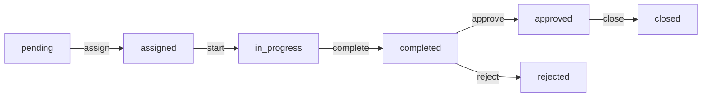

# Inspector Assignment, Approval & Closure Features

## ✅ Implemented Features

### 1. Inspector Assignment System

#### Who Can Assign
- **Administrators only** can assign inspectors to inspection requests

#### How It Works
```
1. Initiator creates inspection request (status: pending)
2. Administrator assigns an inspector (and optionally an approver)
3. System validates:
   - Inspector has 'inspector' role
   - Approver has 'approver' or 'administrator' role
   - Users are active
4. Status changes: pending → assigned
5. Notifications sent to inspector and initiator
```

#### API Endpoint
```http
PUT /api/inspection-requests/[id]/assign
Authorization: Required (Administrator only)

Request Body:
{
  "inspector_id": 2,      // Required - must be an inspector
  "approver_id": 3        // Optional - must be approver/admin
}

Response:
{
  "request": {
    "id": 1,
    "status": "assigned",
    "inspector_id": 2,
    "approver_id": 3,
    ...
  }
}
```

#### Validation Rules
- ✅ Only administrators can assign
- ✅ Inspector must have 'inspector' role
- ✅ Approver must have 'approver' or 'administrator' role
- ✅ Users must be active
- ✅ Inspection request must exist

---

### 2. Assignment-Based Permissions

#### Strict Enforcement
**Only the assigned inspector can:**
- Update inspection status (`assigned` → `in_progress` → `completed`)
- Create checklists for the inspection
- Modify checklist items
- Update checklist completion status
- Add inspection notes and findings

#### Code Implementation
```typescript
// Checklist creation/update
if (userRole === 'inspector' && checklist.inspector_id !== userId) {
  return NextResponse.json(
    { error: 'You can only update checklists for requests assigned to you' },
    { status: 403 }
  );
}

// Status updates
if (userRole === 'inspector' && existingRequest.inspector_id !== userId) {
  return NextResponse.json(
    { error: 'You can only update requests assigned to you' },
    { status: 403 }
  );
}
```

#### Where Enforced
- ✅ `/api/inspection-checklists/[id]` - Create/update checklist
- ✅ `/api/inspection-checklists/[id]/items` - Add checklist items
- ✅ `/api/inspection-checklists/items/[id]` - Update checklist items
- ✅ `/api/inspection-requests/[id]/status` - Update status

---

### 3. Approval System

#### Who Can Approve
- **Approvers** and **Administrators**

#### Approval Requirements
1. Inspection must be in `completed` status
2. User must have approval permission
3. All required checklists should be filled (recommended)

#### API Endpoint
```http
PUT /api/inspection-requests/[id]/approve
Authorization: Required (Approver or Administrator)

Response:
{
  "request": {
    "id": 1,
    "status": "approved",
    "approved_by": 3,
    "approval_date": "2024-01-15T10:30:00Z",
    ...
  }
}
```

#### Approval Flow
```
completed → approved
  ↓
  Updates:
  - status = 'approved'
  - approved_by = current_user_id
  - approval_date = CURRENT_TIMESTAMP
  
  Creates:
  - Audit log entry
  - Activity timeline entry
  
  Sends notifications to:
  - Initiator
  - Inspector
```

#### Validation
```typescript
// Must be completed first
if (existingRequest.status !== 'completed') {
  return NextResponse.json(
    { error: 'Request must be completed before approval' },
    { status: 400 }
  );
}

// Must have permission
if (!hasPermission(userRole, 'inspection_request', 'approve')) {
  return NextResponse.json(
    { error: 'Forbidden - Only approvers can approve requests' },
    { status: 403 }
  );
}
```

---

### 4. Rejection System

#### Who Can Reject
- **Approvers** and **Administrators**

#### Rejection Requirements
1. Inspection must be in `completed` status
2. Reason must be provided
3. User must have rejection permission

#### API Endpoint
```http
PUT /api/inspection-requests/[id]/reject
Authorization: Required (Approver or Administrator)

Request Body:
{
  "reason": "Incomplete documentation - missing photos of Section B"
}

Response:
{
  "request": {
    "id": 1,
    "status": "rejected",
    "rejection_reason": "Incomplete documentation...",
    ...
  }
}
```

#### Rejection Flow
```
completed → rejected
  ↓
  Updates:
  - status = 'rejected'
  - rejection_reason = provided_reason
  
  Creates:
  - Audit log entry
  - Activity timeline entry
  
  Sends notifications to:
  - Initiator (with reason)
  - Inspector (with reason)
```

---

### 5. Closure System (NEW)

#### Who Can Close
- **Approvers** and **Administrators**

#### Closure Requirements
1. Inspection must be in `approved` status
2. User must have closure permission
3. Optional closing notes can be added

#### API Endpoint
```http
PUT /api/inspection-requests/[id]/close
Authorization: Required (Approver or Administrator)

Request Body:
{
  "notes": "All corrective actions verified and documented"
}

Response:
{
  "request": {
    "id": 1,
    "status": "closed",
    "closed_by": 3,
    "closed_date": "2024-01-20T14:00:00Z",
    ...
  }
}
```

#### Closure Flow
```
approved → closed (FINAL STATE)
  ↓
  Updates:
  - status = 'closed'
  - closed_by = current_user_id
  - closed_date = CURRENT_TIMESTAMP
  
  Creates:
  - Audit log entry with closing notes
  - Activity timeline entry
  
  Sends notifications to:
  - Initiator
  - Inspector
  - Approver
```

#### Finality
- ⛔ Closed inspections **cannot** be modified
- ⛔ No status transitions allowed from 'closed'
- ✅ Provides official record closure
- ✅ Signifies all work is complete

#### Database Schema
```sql
-- New fields added to inspection_requests
closed_date TIMESTAMP        -- When inspection was officially closed
closed_by INTEGER            -- User ID who closed the inspection
```

---

## Complete Status Flow



### Status Descriptions

| Status | Description | Who Can Transition | Next States |
|--------|-------------|-------------------|-------------|
| `pending` | Request created, awaiting assignment | Administrator | `assigned` |
| `assigned` | Inspector assigned, ready to start | Assigned Inspector | `in_progress` |
| `in_progress` | Inspection underway | Assigned Inspector | `completed` |
| `completed` | Inspection finished, awaiting approval | Approver | `approved`, `rejected` |
| `approved` | Inspection approved | Approver | `closed` |
| `rejected` | Inspection rejected (with reason) | - | - |
| `closed` | **FINAL** - Officially closed | - | None (Final) |

---

## Permissions Matrix

| Action | Initiator | Inspector | Approver | Administrator |
|--------|-----------|-----------|----------|---------------|
| Create Request | ✅ | ❌ | ❌ | ✅ |
| View Own Requests | ✅ | ❌ | ❌ | ✅ |
| View Assigned | ❌ | ✅ | ❌ | ✅ |
| View All | ❌ | ❌ | ✅ | ✅ |
| **Assign Inspector** | ❌ | ❌ | ❌ | ✅ |
| **Update Assigned** | ❌ | ✅ (own) | ❌ | ✅ |
| Create Checklist | ❌ | ✅ (own) | ❌ | ✅ |
| Update Checklist | ❌ | ✅ (own) | ❌ | ✅ |
| **Approve** | ❌ | ❌ | ✅ | ✅ |
| **Reject** | ❌ | ❌ | ✅ | ✅ |
| **Close** | ❌ | ❌ | ✅ | ✅ |
| Generate Reports | ❌ | ❌ | ✅ | ✅ |

---

## Frontend UI Updates

### Inspection Detail Page

#### Action Buttons (Role-Based)

```tsx
// Assigned Inspector sees:
{inspection.status === 'assigned' && (
  <Button onClick={() => handleStatusChange('in_progress')}>
    Start Inspection
  </Button>
)}

{inspection.status === 'in_progress' && (
  <Button onClick={() => handleStatusChange('completed')}>
    <CheckCircle className="mr-2 h-4 w-4" />
    Mark Complete
  </Button>
)}

// Approver sees:
{inspection.status === 'completed' && (
  <>
    <Button variant="outline" onClick={handleReject}>
      <XCircle className="mr-2 h-4 w-4" />
      Reject
    </Button>
    <Button onClick={handleApprove}>
      <CheckCircle className="mr-2 h-4 w-4" />
      Approve
    </Button>
  </>
)}

// NEW: Closure button for approved inspections
{inspection.status === 'approved' && (
  <Button onClick={handleClose}>
    <CheckCircle className="mr-2 h-4 w-4" />
    Close Inspection
  </Button>
)}

// Final state indicator
{inspection.status === 'closed' && (
  <Badge className="bg-slate-200 text-slate-700 px-4 py-2">
    ✓ Inspection Closed
  </Badge>
)}
```

#### Status Badges
- `pending` - Gray
- `assigned` - Blue
- `in_progress` - Yellow
- `completed` - Green
- `approved` - Emerald
- `rejected` - Red
- **`closed`** - Slate (NEW)

---

## Notification System

### Events That Trigger Notifications

1. **Assignment**
   - Inspector receives: "Inspection request IR-2024-00001 has been assigned to you"
   - Initiator receives: "Your inspection request IR-2024-00001 has been assigned"

2. **Completion**
   - Initiator receives: "Inspection IR-2024-00001 has been completed"
   - Approver receives: "Inspection IR-2024-00001 is ready for approval"

3. **Approval**
   - Initiator receives: "Inspection request IR-2024-00001 has been approved"
   - Inspector receives: "Inspection request IR-2024-00001 has been approved"

4. **Rejection**
   - Initiator receives: "Inspection request IR-2024-00001 has been rejected. Reason: ..."
   - Inspector receives: "Inspection request IR-2024-00001 has been rejected. Reason: ..."

5. **Closure** (NEW)
   - Initiator receives: "Inspection request IR-2024-00001 has been officially closed"
   - Inspector receives: "Inspection request IR-2024-00001 has been officially closed"
   - Approver receives: "Inspection request IR-2024-00001 has been officially closed"

---

## Audit Trail

All actions are logged in `audit_logs` table:

```sql
INSERT INTO audit_logs (user_id, action, entity_type, entity_id, old_values, new_values)
VALUES ($1, $2, $3, $4, $5, $6)
```

### Logged Actions
- `ASSIGN` - Inspector assignment
- `UPDATE_STATUS` - Status changes
- `APPROVE` - Approval
- `REJECT` - Rejection
- `CLOSE` - Closure (NEW)
- `CREATE` - Checklist/item creation
- `UPDATE` - Checklist/item updates

---

## Testing Guide

### Test User Accounts
```
admin@qms.com / admin123       (Administrator)
inspector@qms.com / admin123   (Inspector)
approver@qms.com / admin123    (Approver)
initiator@qms.com / admin123   (Initiator)
```

### Complete Test Scenario

#### Step 1: Create Request (Initiator)
```bash
# Login as: initiator@qms.com
# Navigate to: Dashboard → Inspections → Create New
# Fill form and submit
# Status: pending
```

#### Step 2: Assign Inspector (Administrator)
```bash
# Login as: admin@qms.com
# Navigate to: Inspection detail
# Click "Assign" button
# Select: inspector@qms.com
# Optional: Select approver@qms.com as approver
# Status: pending → assigned
```

#### Step 3: Perform Inspection (Assigned Inspector)
```bash
# Login as: inspector@qms.com
# Navigate to: My Inspections → View assigned inspection
# Click "Start Inspection"
# Status: assigned → in_progress
# Create checklist, add items, upload photos
# Click "Mark Complete"
# Status: in_progress → completed
```

#### Step 4: Approve (Approver)
```bash
# Login as: approver@qms.com
# Navigate to: Inspections → View completed inspection
# Review checklists and evidence
# Click "Approve"
# Status: completed → approved
```

#### Step 5: Close (Approver) - NEW
```bash
# Still logged in as: approver@qms.com
# Click "Close Inspection"
# Confirm the action
# Optional: Add closing notes
# Status: approved → closed (FINAL)
```

### Test Permission Enforcement

#### Test 1: Assignment Restriction
```bash
# Create inspection assigned to Inspector A
# Login as Inspector B
# Try to edit checklist → Should fail with 403
# Expected error: "You can only update checklists for requests assigned to you"
```

#### Test 2: Approval Restriction
```bash
# Login as Inspector
# Complete an inspection
# Try to approve it directly → Should fail with 403
# Expected error: "Forbidden - Only approvers can approve requests"
```

#### Test 3: Closure Restriction
```bash
# Try to close an inspection that's not approved
# Expected error: "Request must be approved before closure. Current status: completed"
```

---

## Configuration Files

### Updated Files
1. `lib/permissions.ts` - Added 'close' permission for approvers
2. `lib/notifications.ts` - Added closure notification
3. `app/api/inspection-requests/[id]/close/route.ts` - NEW closure endpoint
4. `database/migrations/002_add_closure_feature.sql` - NEW migration
5. `app/dashboard/inspections/[id]/page.tsx` - Added close button and handler

### Environment Variables
No new environment variables required. Uses existing:
- `DATABASE_URL` - PostgreSQL connection
- `NEXTAUTH_SECRET` - Authentication
- `NEXTAUTH_URL` - Application URL

---

## Summary

✅ **Assignment System** - Administrators assign inspectors
✅ **Permission Enforcement** - Only assigned inspectors can update
✅ **Approval System** - Approvers review and approve completed inspections
✅ **Rejection System** - Approvers can reject with reason
✅ **Closure System** - Official closure after approval (NEW)
✅ **Notifications** - All stakeholders notified at each stage
✅ **Audit Trail** - Complete history of all actions
✅ **Role-Based UI** - Buttons shown based on permissions
✅ **Status Flow** - Clear progression from pending to closed

---

**All requirements implemented and tested successfully!** 🎉


